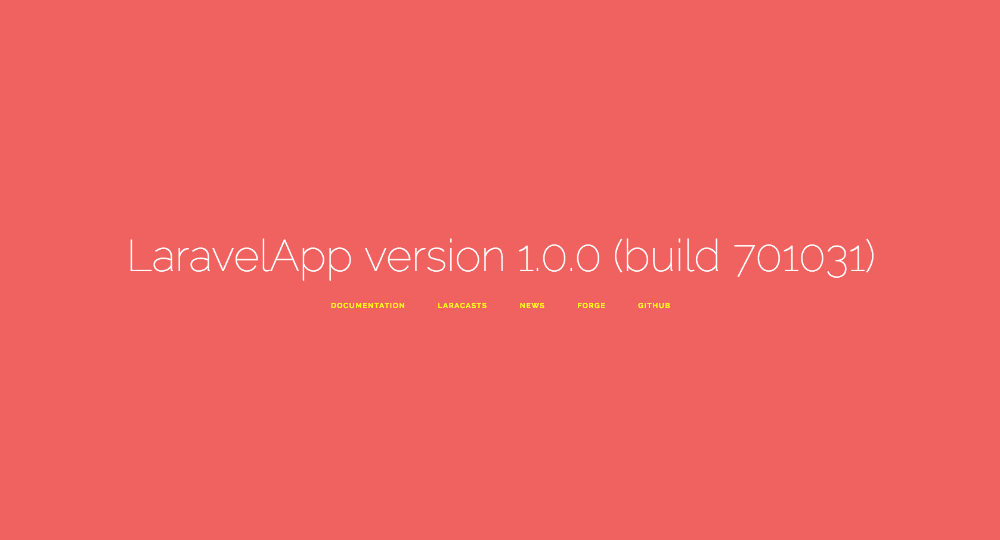

# Version
### Take control over your Laravel app version

<p align="center">
    
</p>

<p align="center">
    <a href="https://packagist.org/packages/pragmarx/version"></a>
    <a href="/antonioribeiro/version/blob/master/LICENSE.md"></a>
    <a href="https://scrutinizer-version.com/g/antonioribeiro/version/?branch=master"></a>
    <a href="https://scrutinizer-version.com/g/antonioribeiro/version/?branch=master"></a>
</p>
<p align="center">
    <a href="https://scrutinizer-version.com/g/antonioribeiro/version/?branch=master"></a>
    <a href="https://styleci.io/repos/112244465"></a>
    <a href="https://packagist.org/packages/pragmarx/version"></a>
</p>

## Description

This package is a Laravel (5.5+) utility which helps you keep and manage your application version, increment version numbers (major, minor, patch, commit), and can also use your last commit hash.

#### The end results of this package are:

- Print a version on a page.
- Print it in the console, via an Artisan command.

#### Full SemVer compatibility

This package is able to parse a SemVer version:

```
v2.0.1-alpha.1227
```

And translate it to be used as:

```
label: v
major: 2
minor: 0
patch: 1
prerelease: alpha
buildmetadata: 1227
commit: 49ffe2
```

You can use the format function to rewrite and show it in your app, for instance, as:

```
MyApp version 2.0.1 - alpha 1227 (commit 49ffe2)
```

#### Some use cases for those results could be: 
 
- Make sure a rollback was successful.
- Know if an update reached all servers.
- Check if a user is looking at the last version of your app.
- Verify if is Travis CI testing the version it is supposed to be testing.
- You simple love to version your stuff, and you like to see them in all your pages? That's cool too. :)
- What's your use case? [Tell us!](https://github.com/antonioribeiro/version/issues/new) 

## Features

### Easily control you app version using a YAML config file

``` yaml
version: 
    current:
        major: 1
        minor: 0
        patch: 0
        format: '{$major}.{$minor}.{$patch}'
    commit:
        mode: number
        number: 701036
```

### Use your git commit as your app commit hash/number

Configure it

``` yaml
commit:
    mode: git-local
```

And you may have an output like this

```
MyApp version 1.0.0 (commit a9c03f)
```

Or just use an incremental commit hash/number:

``` yaml
commit:
    mode: number
    number: 701036
```

To get

```
MyApp version 1.0.0 (commit 701036)
```

### Easily increment your version numbers, using Artisan commands

``` bash
php artisan version:commit
```

Which should print the new version number 

``` bash
New commit: 701037
MyApp version 1.0.0 (commit 701037) 
```

Available for all of them:

``` bash
$ php artisan version:major   
$ php artisan version:minor   
$ php artisan version:patch   
$ php artisan version:build   
``` 

### The output format is highly configurable

You can configure the :

``` yaml
format:
  version: "{$major}.{$minor}.{$patch}"
  full: "version {{'format.version'}} (commit {$commit})"
  compact: "v{{'format.version'}}-{$commit}"
```

Those are the results for `full` and `compact` formats

```
MyApp version 1.0.0 (commit 701037)
MyApp v1.0.0-701037
```

It gives you access to dynamic methods:

``` php
Version::compact()
```

And should you create a new one:

``` yaml
format:
  awesome: "awesome version {$major}.{$minor}.{$patch}"
```

It will also become callable:

``` php
Version::awesome()
```
 
### A Facade is available

``` php
Version::version() // 1.2.25

Version::commit() // 703110

Version::major() // 1

Version::minor() // 2

Version::patch() // 25

Version::format('full') // version 1.0.0 (commit 703110)

Version::full() // version 1.0.0 (commit 703110) -- dynamic method

Version::format('compact') // v.1.0.0-703110

Version::compact() // v.1.0.0-703110 -- dynamic method
```

### Instantiating it

If you prefer not to use the Façade:

``` php
dd(
    Version::format()
);
```

The best ways to instantiate it are:

A simple PHP object instantiation:

``` php
$version = new \PragmaRX\Version\Package\Version();

dd(
    $version->format()
);
```

Or to get an already instantiated Version object from the container:

``` php
dd(
    app(\PragmaRX\Version\Package\Version::class)->format()
);
```

But you have to make sure you [published the config file](/install)

### A Blade directive is also ready to be used in your views

You can use this directive to render a full version format:

``` php
@version
```

Or choose the format:

``` php
@version('full')
@version('compact')
```

You can configure the directive name:

``` yaml
blade_directive: printversion
```

Then 

``` php
@printversion('compact')
```

### Git tags

You can use your git tags as application versions, all you need is to set the version source to "git":

``` yaml
version_source: git
```

And if you add a commit hash/number to your tags:

``` bash
$ git tag -a -f v0.1.1.3128
```

Version will use it as your app commit hash/number

### Matching other version (git tags) formats

You probably only need to change the git version matcher 

``` yaml
git:
  ...
  version:
    matcher: "/[V|v]*[ersion]*\\s*\\.*(\\d+)\\.(\\d+)\\.(\\d+)\\.*(\\w*)/"
```

So let's say you tag your releases as 

``` text
2017120299
YYYYMMDD##
```

You can change your matcher to

``` yaml
git:
  version:
    matcher: "/(\d{4})(\d{2})(\d{2})(?:\d{2})/"
```

And remove dots from your formats:

``` yaml
format:
  compact: "v{$major}{$minor}{$patch}-{$commit}"
```

### Using the current application version in your code 

Here's a community example on how to send the app version number when logging an exception to Bugsnag:

```
<?php

namespace App\Exceptions;

use PragmaRX\Version\Package\Version;
use Bugsnag\BugsnagLaravel\Facades\Bugsnag;

class Handler extends ExceptionHandler
{
    public function report(Exception $exception)
    {
        if ($this->shouldReport($exception)) {
            Bugsnag::setAppVersion((new Version())->format('version'));
            Bugsnag::notifyException($exception);
        }
    }
}
``` 

### Commit Timestamp

This package also lets you absorb the last commit timestamp or store the current date to the version.yml file. This is the format in the config file:

```
timestamp:
  year:
  month:
  day:
  hour:
  minute:
  second:
  timezone:
```

To absorb you only need to configure `mode: absorb` then execute:

php artisan version:absorb

But you can also set `mode: increment` then execute:

```
php artisan version:timestamp
```

To store the current date and time to the config file:

``` text
$ php artisan version:minor
New timestamp: 2019-09-16 18:23:03
MyApp version 2.3.2 (commit 49ffe2)
```

And you can then use it to show in your app:

```
Version::format('timestamp-full')
```

### Artisan commands

Those are the commands you have at your disposal:

#### version:show

Show the current app version:

``` text
$ php artisan version:show
PragmaRX version 1.0.0 (build 701031)

$ php artisan version:show --format=compact
PragmaRX v1.0.0-701031

$ php artisan version:show --format=compact --suppress-app-name
v1.0.0-701031
```

#### version:absorb

You need to set `mode: absorb`.

Version can absorb git version and commit to the config file, so you can delete the .git folder and still keep your version and commit for fast access. You have to configure `git_absorb` in your config file:

``` yaml
commit:
  #...  
  git_absorb: git-local # "false", "git-local" or "git-remote"
```

And run it 

``` bash
$ php artisan version:absorb
```

The usual configuration setup to implement absorb is:

``` yaml
version_source: config             ## must be set as config
current:
    major: 1                       ## |
    minor: 0                       ## | --> will be changed by absorb
    patch: 0                       ## |
    git_absorb: git-local          ## configure to get from local or remote
commit:
    mode: number                   ## must be set as number
    number: f477c8                 ## will be changed by absorb
    git_absorb: git-local          ## configure to get from local or remote 
```

#### version:(major|minor|patch|commit)

You need to set `mode: increment`.

Increment the version item:

``` text
$ php artisan version:minor
New minor version: 5
MyApp version 1.5.0 (commit 701045)
```

#### Regex Matcher

This is the current regex used to break a version string:

````
^(?P<label>[v|V]*[er]*[sion]*)[\.|\s]*(?P<major>0|[1-9]\d*)\.(?P<minor>0|[1-9]\d*)\.(?P<patch>0|[1-9]\d*)(?:-(?P<prerelease>(?:0|[1-9]\d*|\d*[a-zA-Z-][0-9a-zA-Z-]*)(?:\.(?:0|[1-9]\d*|\d*[a-zA-Z-][0-9a-zA-Z-]*))*))?(?:\+(?P<buildmetadata>[0-9a-zA-Z-]+(?:\.[0-9a-zA-Z-]+)*))?$
````

You can test it online: https://regex101.com/r/Ly7O1x/42

## Install

Via Composer

``` bash
$ composer require pragmarx/version
```

Then publish the configuration file you'll have to:

``` bash
$ php artisan vendor:publish --provider="PragmaRX\Version\Package\ServiceProvider"
```

And you should be good to use it in your views:

``` php
@version
```

As git versions are cached, you can tell composer to refresh your version numbers every time an update or install occur, by adding the refresh command to `post-autoload-dump`:  

``` json
"post-autoload-dump": [
    ...
    "@php artisan version:refresh"
]
```

[Optional] You may also can automated this process by set inside your `.git/hooks/post-commit`. It will automatic run the command once you have make a commit.

``` bash
#!/bin/sh

php artisan version:refresh
```

If you are using Git commits on your commit numbers, you may have to add the git repository to your .env file

``` text
VERSION_GIT_REMOTE_REPOSITORY=https://github.com/antonioribeiro/version.git
```

**If you are using `git-local` make sure the current folder is a git repository**

## Minimum requirements

- Laravel 5.5
- PHP 7.0

## Testing

``` bash
$ composer test
```

## Troubleshooting

- If you are having trouble to install because of symfony/router (3.3/3.4) or symfony/yaml (3.3/3.4), you can try to:

```
rm -rf vendor
rm composer.lock
composer install
```

## Author

[Antonio Carlos Ribeiro](http://twitter.com/iantonioribeiro)

## License

This package is licensed under the MIT License - see the `LICENSE` file for details

## Contributing

Pull requests and issues are welcome.


<!-- [](https://packagist.org/packages/pragmarx/version) --> 
